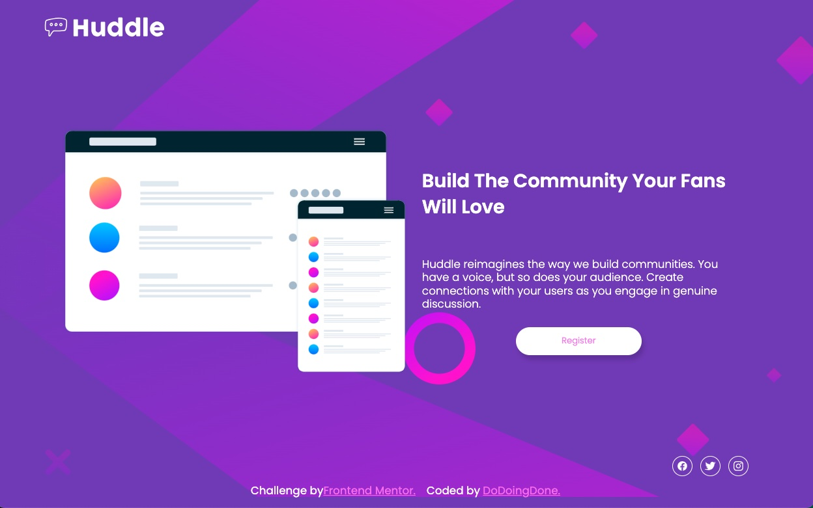

# Huddle-landing-page-single
Huddle landing page with flexbox and responsive design

### Screenshot

Then crop/optimize/edit your image however you like, add it to your project, and update the file path in the image above.

### Links

- Solution URL: https://github.com/DoDoingDone/Huddle-landing-page-single
- Live Site URL: [Add live site URL here](https://your-live-site-url.com)

## My process

I tried to work with a mobile-first design, which is still a little challenging, but I'm getting the hang of it.  I worked more methodically this time, trying not to jump forward in the design until I got the basics laid out.

### Built with

- Semantic HTML5 markup
- CSS custom properties
- Flexbox
- Mobile-first workflow

### What I learned

I'm picking up more on flexbox, and css in general.  

If you want more help with writing markdown, we'd recommend checking out [The Markdown Guide](https://www.markdownguide.org/) to learn more.

### Continued development

I am continuing to work on my semantic HTML as well as flexbox and grid.  I really need to focus on the magic that is css and become solidly proficient before I move on to more advanced work.

### Useful resources

I scanned youtube and the internet quite a bit when I got stuck getting the images to cooperate, but finally figured it out on my own. (yay, me!)

## Author
- Frontend Mentor - https://www.frontendmentor.io/profile/DoDoingDone
